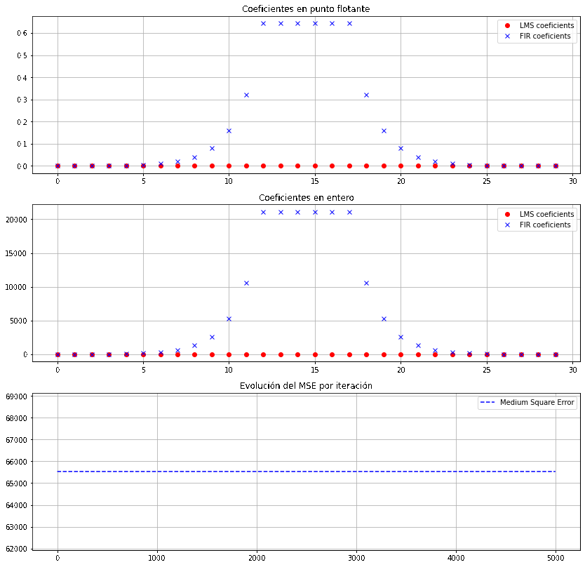
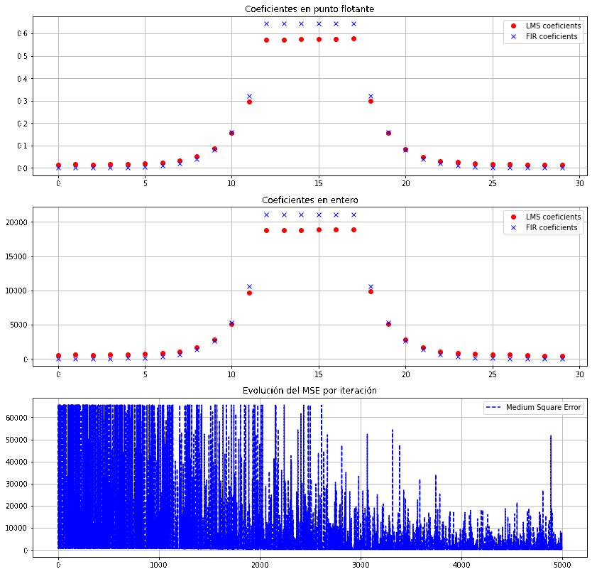

# Adaptative_filters_FRDMK64F
---
## Índice / Index

1. [Español](#español).
	1.  [Descripción general del programa](#descripción-general-del-programa).
	2.  [Resultados](#resultados).
2. [English](#english).
	1. [General program description](#general-program-description).
	2. [Results](#results).
   
### Español

Se utiliza un filtro adaptativo para identificar una planta cuya función de transferencia es desconocida, representada
con un filtro FIR.

Para ello se utilizan las funciones de CMSIS para filtros [FIR](https://arm-software.github.io/CMSIS_5/DSP/html/group__FIR.html) y para filtros [LMS](https://arm-software.github.io/CMSIS_5/DSP/html/group__LMS.html).

### Descripcion general del programa

Primero inicializa los elementos de cada filtro de acuerdo a la documentació de CMSIS.

Luego, crea un arreglo de 100 muestras aleatorias utilizando la función de C *rand()*. Se castea el valor devuelto por la función, que es tipo entero signado, a formato de punto fijo. También se utilizan los bits más significativos de dicho entero (en particular los 12 MSB se utilizan, haciendo un shift hacia la derecha de 20 posiciones). Esto sirve para luego poder jugar con la amplitud de dicha señal, al multiplicarla por una variable (*signal_power*), que el usuario puede modificar con uno de los botones de la placa.

Finalmente, se computa la planta (filtro FIR) con las entradas aleatorias y luego con la salida de la planta, las entradas aleatorias y el error (diferencia entre la referencia y la salida anterior) se computa la salida actual del filtro adaptativo. Este proceso se repite *NUMFRAMES* cantidad de veces. 

Para cada repetición, se computa el MSE (medium square error) de la siguiente forma:
```
for(uint16_t k = 0; k < BLOCKSIZE; k++)
{
    mse[i] += err[k] * err [k];
}
mse[i] = mse[i] / BLOCKSIZE;
if(mse[i] > 262143)
    mse[i] = 262143;
```
Al ser el arreglo *mse* de tipo q32_t (se decidió una variable del doble de tamaño que del err, que es de tipo q15_t, debido a que en la operación de multiplicación se duplica el número de bits de la variable involucrada). En un principio se pensó en transmitir sólo los 16 MSB de mse, para evitar transmitir demasiados datos. Pero ocurrió que el error “más grande” al principio, era tan solo de 2^22, por lo que si se utilizan los bits 16 a 32 solo los 6 LSB tendrían valores distintos de 0. Este error no era representativo y no se podía visualizar correctamente. Por lo tanto, se aplicó una saturación al valor 262143 (que es igual a 2^17-1) para utilizar luego los bits entre 2 a 17 del mse. Esto se justifica en que no es relevante para el análisis que el error sea “grande” al principio, pero si es de interés no perder la información de los bits menos significativos ya que van a mostrar hasta qué valor realmente disminuye el error.

Al terminar todas las iteraciones, se envían los valores de los coeficientes y del MSE utilizando el puerto serie para que sean procesados y analizados en forma gráfica por un script desarrollado en Python ([plot_serial.ipynb](./plot_serial.ipynb)) para analizar como afecta el valor de μ (*mu*) del filtro LMS a la precisión de la detección de la planta. También es de interés analizar la relación de 
compromiso entre los valores que puede adoptar μ (*mu*) y la amplitud de la señal de entrada (*signal_power*).

La trama que se utilizó para enviar los datos es la siguiente:

        Byte N°     |       Data
    ----------------------------------------------
            0       |   lms_coeficients[0] LowByte
            1       |   lms_coeficients[0] HighByte
           ...      |           “
            60      |   lms_coeficients[29] LowByte
            61      |   lms_coeficients[29] HighByte
            62      |   fir_coeficients[0] LowByte
            63      |   fir_coeficients[0] HighByte
            ...     |           “
            118     |   FIRCoeff_q15[29] LowByte
            119     |   FIRCoeff_q15[29] HighByte
            120     |   (mse[0] >> 2) & 0x0FF
            121     |   (mse[0] >> 10) & 0x0FF
            ...     |           “
            10118   |   (mse[9999] >> 2) & 0x0FF
            10119   |   (mse[9999] >> 10) & 0x0FF

	
También se implementó un sistema para modificar el μ y la potencia de señal de entrada con los pulsadores de la placa, donde luego de haber incrementado la variable se reinicia el sistema y se corre nuevamente la detección de planta.


### Resultados

A continuación se muestran algunos gráficos con la evolución de los coeficientes y el error para la variación de μ a amplitud de entrada constante:



A continuación se muestran algunos gráficos con la evolución de los coeficientes y el error para la variación de la amplitud de entrada a μ constante:



## English

An adaptive filter is used to identify a plant whose transfer function is unknown, represented
with a FIR filter.

For this, the CMSIS functions for [FIR](https://arm-software.github.io/CMSIS_5/DSP/html/group__FIR.html) and for [LMS](https://arm-software.github.io/CMSIS_5/DSP/html/group__LMS.html) filters.

### General program description

First the elements of each filter are initialized, according to the CMSIS documentation.

Next, an array of 100 random samples is created using the C *rand ()* function. The value returned by the function is a signed integer type, so is casted to fixed point format. The most significant bits of the integer are used (in particular the 12 MSBs, making a 20-position right shift). This is useful in order to be able to play with the amplitude of the imput signal, by multiplying it by a variable (*signal_power*), which the user can modify with one of the buttons on the board.

Finally, the plant is computed (FIR filter) with the random inputs and then with the output of the plant, the random inputs and the error (difference between the reference and the previous output) the current output of the adaptive filter is computed. This process is repeated *NUMFRAMES* number of times.

For each repetition, the MSE (medium square error) is computed as follows:

```
for(uint16_t k = 0; k < BLOCKSIZE; k++)
{
    mse[i] += err[k] * err [k];
}
mse[i] = mse[i] / BLOCKSIZE;
if(mse[i] > 262143)
    mse[i] = 262143;
```

As the *mse* array is of type q32_t (a variable twice the size of err, which is of type q15_t, was decided upon, due to the fact that the number of bits of the variable  is doubled in the multiplication operation). At first it was thought of transmitting only 16 MSB of mse, to avoid transmitting too much data. But it happened that the "biggest" error at the beginning was only 2^22, so if bits 16 to 32 were used, only the 6 LSBs would have had values different from 0. This error was not representative and could not be displayed correctly. Therefore, a saturation was applied to the value 262143 (which is equal to (2^17)-1) to then use the bits between 2 to 17 of the *mse*. This is justified in that it is not relevant for the analysis that the error is "large" at the beginning, but it is of interest not to lose the information of the least significant bits since they will show up to what value the error actually decreases over the iterations.

At the end of all the iterations, the values of the coefficients and the MSE are sent using the serial port to be processed and analyzed graphically by a script developed in Python ([plot_serial.ipynb](./plot_serial.ipynb)) to analyze how the μ (*mu*) value of the LMS filter affects the precision of plant detection. It is also of interest to analyze the trade-off relationship between the values that μ (*mu*) can take and the amplitude of the input signal (*signal_power*).

The data-frame that was used to send the data is as follows:

        Byte N°     |       Data
    ----------------------------------------------
            0       |   lms_coeficients[0] LowByte
            1       |   lms_coeficients[0] HighByte
           ...      |           “
            60      |   lms_coeficients[29] LowByte
            61      |   lms_coeficients[29] HighByte
            62      |   fir_coeficients[0] LowByte
            63      |   fir_coeficients[0] HighByte
            ...     |           “
            118     |   FIRCoeff_q15[29] LowByte
            119     |   FIRCoeff_q15[29] HighByte
            120     |   (mse[0] >> 2) & 0x0FF
            121     |   (mse[0] >> 10) & 0x0FF
            ...     |           “
            10118   |   (mse[9999] >> 2) & 0x0FF
            10119   |   (mse[9999] >> 10) & 0x0FF

A system to modify the μ and the input signal power with the buttons on the panel was also implemented. After having increased the variable, the system is restarted and the plant detection is run again.

### Results

Below are some graphs with the evolution of the coefficients and the error while varying μ at constant input amplitude:


Below are some graphs with the evolution of the coefficients and the error while varying the input amplitude at constant μ:


